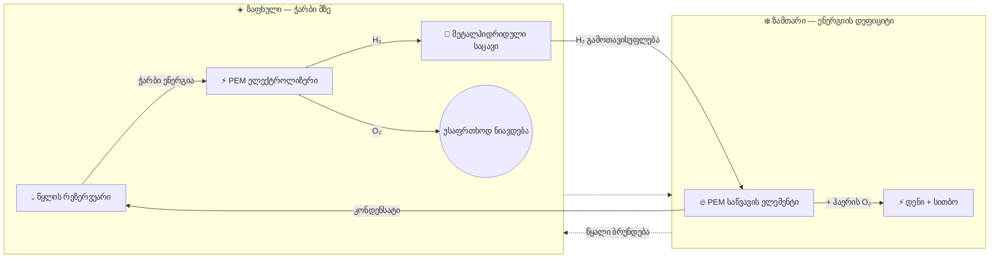

<div align="center">

# 🏔️ HydroGrid 🔋💧

### სეზონური მწვანე წყალბადის ენერგოსისტემა მაღალმთიანი ავტონომიური ობიექტებისთვის

[](https://prostogio.github.io/HydroGrid/presentation/simulation)
[](https://prostogio.github.io/HydroGrid/presentation/dashboard/)
[](#)
[](#)

**დახურული წყალბადის სისტემა, რომელიც ინახავს ზაფხულის ჭარბ მზის ენერგიას და ათავისუფლებს მას ზამთრის დენად — სუფთა წყალი ერთადერთი გვერდითი პროდუქტია.**

[🌐 მოლეკულური სიმულაცია](https://prostogio.github.io/HydroGrid/presentation/simulation) · [📊 ინტერაქტიული დაფა](https://prostogio.github.io/HydroGrid/presentation/dashboard/) · [🧩 სისტემის სქემა](https://prostogio.github.io/HydroGrid/presentation/schematics/)

**წაიკითხეთ:** [English](./README.md) · [Русский](./README.ru.md) · ქართული

</div>

---

## 📑 სარჩევი

- [მიმოხილვა](#-მიმოხილვა)
- [პრობლემა](#-პრობლემა)
- [დახურული ციკლის არქიტექტურა](#-დახურული-ციკლის-არქიტექტურა)
- [სისტემის სქემა](#-სისტემის-სქემა)
- [სიმულაცია და რეალურ მონაცემებზე ვალიდაცია](#-სიმულაცია-და-რეალურ-მონაცემებზე-ვალიდაცია)
- [რატომ არა უბრალოდ ბატარეები?](#-რატომ-არა-უბრალოდ-ბატარეები)
- [სისტემის მართვა და სიმულაცია](#-სისტემის-მართვა-და-სიმულაცია)
- [რეპოზიტორიის სტრუქტურა](#-რეპოზიტორიის-სტრუქტურა)

---

## 🌍 მიმოხილვა

მაღალმთიან რეგიონებში მდებარე ობიექტები — კვლევითი სადგურები, მეტეოროლოგიური პუნქტები, რეინჯერთა კაბინები — ძირითადად მზის ენერგიაზეა დამოკიდებული. ზამთარში კი ქარბუქებისა და დაბალი ტემპერატურის გამო ისინი ხშირად ელექტროენერგიის გარეშე რჩებიან, რადგან ლითიუმის ბატარეები 0°C-ზე დაბლა კარგავენ ეფექტურობას და ზოგჯერ სრულად გამოდიან მწყობრიდან, რაც დიზელის გენერატორებზე გადასვლას აუცილებელს ხდის.

**HydroGrid ხსნის ამ პრობლემას.** სისტემა იჭერს ზაფხულის ჭარბ მზის ენერგიას, გარდაქმნის მას წყალბადად, უსაფრთხოდ ინახავს მთელი ზამთრის განმავლობაში და ისევ გარდაქმნის დენად და სითბოდ ზუსტად მაშინ, როცა საჭიროა — მთლიანად დახურულ ციკლში, სადაც ერთადერთი გვერდითი პროდუქტი სუფთა, გამოხდილი წყალია.

<details>
<summary><b>💭 რატომ არის ეს მნიშვნელოვანი? (დააჭირეთ გასაშლელად)</b></summary>
<br>

დიზელის ტრანსპორტირება მთის მყინვარულ გზებზე ძვირი და სახიფათოა, ხოლო ექსტრემალურ პირობებში ხშირად სრულიად შეუძლებელი — ყინულოვანი გზები იკეტება ზუსტად მაშინ, როცა საწვავი ყველაზე მეტად სჭირდება. გენერატორები ასევე ხმაურიანია, გამოყოფენ მავნე აირებს და აზიანებენ დაცულ ეკოსისტემებს, სადაც ხშირად მდებარეობს ასეთი ობიექტები. HydroGrid გვერდს უვლის ამ ყველაფერს: არც საწვავის მიწოდებაა საჭირო, არც წვის ემისია და არც სეზონური ენერგოდანაკარგი.

</details>

## ⚠️ პრობლემა

| გამოწვევა | ჩვეულებრივი მიდგომა | შეზღუდვა |
|---|---|---|
| ზამთრის ენერგოდეფიციტი | დიზელის გენერატორები | ძვირი, საშიში საწვავის ტრანსპორტირება; გზების ჩაკეტვა |
| შენახვა ცივ ამინდში | ლითიუმის ბატარეები | ეფექტურობა კრახდება 0°C-ზე დაბლა |
| გარემოზე ზემოქმედება | წვის ძრავები | ხმაური, გამონაბოლქვი, ეკოსისტემის დარღვევა |
| ენერგიის სეზონური გადატანა | ქსელური შენახვა | შეუძლებელია ავტონომიურად |

## 🔄 დახურული ციკლის არქიტექტურა

ჩვეულებრივი ბატარეული სისტემებისგან ან ღია წყალბადის სქემებისგან განსხვავებით, HydroGrid მუშაობს სრულად დამოუკიდებელ, უსასრულო მოლეკულურ ციკლზე:



| ეტაპი | კომპონენტი | ფუნქცია |
|---|---|---|
| 1️⃣ | **წყლის რეზერვუარი (H₂O)** | სისტემის საწყისი და ბოლო წერტილი; ინახავს წყალს, რომელიც სეზონურად გამოიყენება |
| 2️⃣ | **PEM ელექტროლიზერი** | ზაფხულის ჭარბი მზის ენერგიით შლის წყალს H₂-ად და O₂-ად; O₂ უსაფრთხოდ ნიავდება |
| 3️⃣ | **მეტალჰიდრიდული საცავი** | ინახავს H₂-ს მყარ სტრუქტურაში, დაბალ წნევაზე (<30 bar) — ყინვაში დეგრადაციის, გაჟონვის ან აფეთქების რისკის გარეშე |
| 4️⃣ | **PEM საწვავის ელემენტი** | ზამთარში აერთებს შენახულ H₂-ს ჰაერის O₂-თან, გამოიმუშავებს დენსა და სითბოს |
| 5️⃣ | **კონდენსატის დაბრუნება** | საწვავის ელემენტის გვერდითი წყალი კონდენსირდება და უბრუნდება რეზერვუარს, კეტავს ციკლს |

## 🧩 სისტემის სქემა

ყველა კომპონენტი ხუთი ძირითადი ეტაპის მიღმა — დამტენის კონტროლერი, წყლის გაწმენდა, აირის გაშრობა, უსაფრთხოების სარქველები, სენსორები, ნარჩენი სითბოს მარშრუტიზაცია — წარმოდგენილია ინტერაქტიულ სქემაზე, სადაც კურსორის დაჭერით ვრცელი აღწერა გამოჩნდება. ხელმისაწვდომია სამ ენაზე:

**▶️ [Multi Language Schematics](https://prostogio.github.io/HydroGrid/presentation/schematics/)**

დააჭირეთ ან გადაატარეთ კურსორი ნებისმიერ ბლოკს ან შემაერთებელს დეტალებისთვის. მუქი, დანომრილი ბლოკები და დაბრუნების ისარი წარმოადგენს ხუთსაფეხურიან ძირითად ციკლს; დანარჩენი ყველაფერი დამხმარე ქვესისტემაა (კვება, უსაფრთხოება, სენსორები, ობიექტის გამომავალი).

## 🧪 სიმულაცია და რეალურ მონაცემებზე ვალიდაცია

ვიზუალური კონცეფციის გარდა, HydroGrid მოიცავს სრულ C++ სიმულაციას რეალური ენერგეტიკული
გამოთვლებით — მზის ენერგია, ელექტროლიზი, შენახვა და დენის გამომუშავება — და ავტომატურ
კონტროლერს, რომელიც ყოველდღიურად წყვეტს, სისტემა უნდა იტენებოდეს თუ იხარჯებოდეს.

**▶️ [ინტერაქტიული ენერგეტიკული დაფის გახსნა](https://prostogio.github.io/HydroGrid/presentation/dashboard/)**
— გადაატანეთ ცოცხები (პანელის ფართობი, ავზის მოცულობა, კაბინის საჭიროება, კომპონენტების
ღირებულება) და ნახეთ, როგორ იქცევა სისტემა რეალურ 90-დღიან ზამთარზე დაყრდნობით, პასუხის და
ჩავარდნის ჩათვლით. (დაფა იმეორებს იმავე ფორმულებს C++ კოდიდან, JavaScript-ში, რომ ბრაუზერში
პირდაპირ იმუშაოს — იხილეთ [რეპოზიტორიის სტრუქტურა](#-რეპოზიტორიის-სტრუქტურა) ორიგინალი
იმპლემენტაციისთვის.)

**როგორ შეიქმნა ეს რეალურად, ეტაპობრივად:**

1. **მზის ენერგია** — გამოყვანილი პირველადი პრინციპებიდან (ვტ/მ² → ჯოული → კვტ.სთ), სიმაღლის
   კორექტირების ჩათვლით, ვიდრე მზა ფორმულის გამოყენება.
2. **ელექტროლიზერი** — გარდაქმნის ელექტროენერგიას წყალბადის მასად, წყალბადის რეალური
   ენერგოტევადობის გამოყენებით (39.7 კვტ.სთ/კგ, კონსერვატიული HHV კონვენცია — განზრახ
   არჩეული დაბალი LHV-ის ნაცვლად, რომ ყველა შედეგი იყოს ყველაზე ცუდი შემთხვევის შეფასება).
3. **შენახვა** — პირველი ეტაპი, რომელსაც დროში მეხსიერება სჭირდება: ავზის დონე ინახება
   დღიდან დღემდე, შეზღუდული 0-სა და მაქსიმალურ ტევადობას შორის.
4. **საწვავის ელემენტი** — ელექტროლიზერის სარკისებური ანარეკლი, გარდაქმნის შენახულ წყალბადის
   მასას უკან ელექტროენერგიად (~55% ეფექტური; დარჩენილი ~45% იქცევა სითბოდ, დოკუმენტირებული
   როგორც კოგენერაციის ბონუსი, ცალკე არ არის მოდელირებული).
5. **მდგომარეობათა მანქანა** — აკავშირებს ოთხივე ფიზიკურ ეტაპს ერთმანეთთან, ადარებს ყოველი
   დღის მზის გამომუშავებას კაბინის მოთხოვნასთან და წყვეტს, დატენოს ავზი, გამოთხაროს თუ
   პატიოსნად შეატყობინოს ჩავარდნის შესახებ (ზუსტი დღისა და ოდენობის მითითებით), თუ
   დეფიციტის დაფარვა ვერ ხერხდება.

**რა ხდის ამას მარტივ მოდელზე მეტს:**

- კონტროლერი გატესტილია **რეალურ 5-წლიან საათობრივ მზის მონაცემებზე (PVGIS-SARAH3)**
  საქართველოს კავკასიონის რეალურ მაღალმთიან წერტილზე (2,715 მ) — არა სინთეზურ ამინდზე.
  ამ მონაცემებში ნაპოვნი ყველაზე ცუდი ზედიზედ დაბალმზიანი პერიოდი იყო 5 დღე.
- შემდეგ სისტემა შემოწმდა სცენარზე, რომელიც განზრახ უფრო რთულია, ვიდრე რამე რეალურად
  დაფიქსირებული (ხელოვნურად გახანგრძლივებული 8-დღიანი შტორმი), რომ შემოწმდეს მარაგი
  ისტორიულ ჩანაწერზე მეტად.
- ავტომატური ძიების ხელსაწყო ამოწმებს პანელის ფართობისა და ავზის მოცულობის კომბინაციებს
  ორივე მონაცემთა ბაზაზე ერთდროულად, ოპტიმიზაციას უტარებს რეალურ ღირებულებებზე დაყრდნობით
  (~$180/მ² პანელი, ~$1,800/კგ მეტალჰიდრიდის ეფექტური ღირებულება) და არა მხოლოდ იმაზე,
  „გადარჩება თუ არა."
- ძიება ასევე ითვალისწინებს *დაკარგულ* ჭარბ ენერგიას (H₂, რომელიც წარმოებულია, მაგრამ
  ამოშვებულია, რადგან ავზი უკვე სავსე იყო), ასე რომ „ყველაზე იაფი" ითვალისწინებს მეტს,
  ვიდრე უბრალოდ გადარჩენის ფაქტს.

**კვლევის პატიოსანი ფარგლები:** ნაპოვნი პანელისა და ავზის კონკრეტული ზომები სწორია ამ
კონკრეტული საცდელი წერტილის რეალურ კლიმატურ მონაცემებზე დაყრდნობით — HydroGrid წარმოადგენს
ზომების განსაზღვრის **მეთოდოლოგიას**, და არა უნივერსალურ სპეციფიკაციას. სხვა ადგილას
(სხვა სიმაღლე, სხვა შტორმის პატერნები) დასჭირდებოდა საკუთარი ისტორიული მზის მონაცემები,
იგივე პროცესში გატარებული.

<details>
<summary><b>📐 ძირითადი დაშვებები, გამოყენებული მთელ პროექტში (დააჭირეთ გასაშლელად)</b></summary>
<br>

- პანელის ეფექტურობა: 20% · ელექტროლიზერის ეფექტურობა: 75% · საწვავის ელემენტის ეფექტურობა: 55%
- წყალბადის ენერგოტევადობა: 39.7 კვტ.სთ/კგ (HHV) — ორი სტანდარტული კონვენციიდან უფრო
  კონსერვატიული, არჩეული იმისთვის, რომ ყველა შემდგომი შედეგი იყოს ყველაზე ცუდი, და არა
  საუკეთესო შემთხვევის შეფასება
- **დღიური ჯამური ენერგიის მოდელი:** ივარაუდება, რომ ავზი და საწვავის ელემენტი აბუფერებენ
  დღის განმავლობაში წარმოებასა და მოხმარებას შორის დროში შეუსაბამობას (მაგ. შუადღეს
  წარმოებული ენერგია ხელმისაწვდომია ღამის 3 საათზეც). რეალურ სისტემას მაინც დასჭირდება
  დამტენის კონტროლერი და მცირე ბუფერული ბატარეა ელექტრული გასწორებისთვის — რეალური
  ტექნიკური მოთხოვნა, მაგრამ ცალკე საკითხი ენერგობალანსისგან, რომელსაც ეს სიმულაცია პასუხობს.
- საწვავის ელემენტის ნარჩენი სითბო (~45% ენერგოტევადობისა) დოკუმენტირებულია როგორც
  კოგენერაციის/გათბობის ბონუსი, ცალკე არ არის მოდელირებული, რადგან პროექტის ძირითადი
  მიზანი ელექტროენერგიაა.
- **მეტალჰიდრიდის დესორბციის სიჩქარე არ არის მოდელირებული:** ყინვა არ ამცირებს ჰიდრიდის
  ავზის მთლიან *ტევადობას* ისე, როგორც ეს ბატარეასთან ხდება — შენახული H₂-ის კგ რჩება კგ
  ტემპერატურის მიუხედავად. მაგრამ მისი გამოთავისუფლება ტემპერატურაზეა დამოკიდებული:
  რეალური LaNi5 ჰიდრიდის კვლევები აჩვენებს, რომ დესორბციის სიჩქარე მნიშვნელოვნად იზრდება
  ტემპერატურასთან ერთად (~1.5-ჯერ სწრაფად 50°C-ზე, ვიდრე 25°C-ზე), ასე რომ ყინვამ შეიძლება
  შეანელოს *რამდენად სწრაფად* გამოდის წყალბადი, მაშინაც კი, როცა საერთო შენახული რაოდენობა
  უცვლელია — ეს სიჩქარის შეზღუდვაა და არა ტევადობის, და ბატარეების საწინააღმდეგო
  წარუმატებლობის რეჟიმი. რეალური სისტემები ჩვეულებრივ ამას აგვარებენ საწვავის ელემენტის
  ნარჩენი სითბოს გამოყენებით ავზის გასათბობად. ეს დღიური ჯამის სიმულაცია ვერ ითვალისწინებს
  სიჩქარით შეზღუდულ სცენარებს (იხილეთ ზემოთ).

</details>

## 🔋 რატომ არა უბრალოდ ბატარეები?

სამართლიანი კითხვაა, და ჯობია ის რეალურად შემოწმდეს, ვიდრე უბრალოდ ვივარაუდოთ პასუხი.
ინტერაქტიულ დაფას აქვს **Li-Ion / LiFePO4 / წყალბადის** გადამრთველი, რეალური 2026 წლის
ფასებითა და თითოეული ქიმიის ცივ ამინდში რეალური ტევადობის კლებით, იმავე რეალურ ზამთრის
მონაცემებზე გატესტილი, რაზეც ზემოთ წყალბადის შედეგებია.

**რეალური შედეგები:**

| შენახვა | კონფიგურაცია | შედეგი რეალურ + გართულებულ ზამთარზე |
|---|---|---|
| წყალბადი | 16 მ² პანელი, **1 კგ** ავზი | ✅ უძლებს, ~$4,680 |
| Li-Ion | 16 მ² პანელი, **10 კვტ.სთ** ბატარეა | ❌ ჩავარდნა მე-8 დღეს, ~$4,380 |
| LiFePO4 | 16 მ² პანელი, **10 კვტ.სთ** ბატარეა | ❌ ჩავარდნა 23-ე დღეს, ~$4,680 |

**დაახლოებით იმავე ჯამური ღირებულებით**, არც ერთი ბატარეის ქიმია ვერ უძლებს — მაშინაც კი,
როცა პირველივე დღეს სავსეა, ზამთრის დაწყებამდე. მიზეზი არ არის ტევადობა ქაღალდზე, არამედ ის,
რასაც ყინვა უკეთებს ამ ტევადობას: ჩვეულებრივ Li-Ion უჯრედებს შეუძლიათ დაკარგონ თითქმის
ნახევარი გამოსადეგი ტევადობისა −20°C-ზე, და მაშინაც კი LiFePO4-მა — რომელიც ცივ ამინდს
გაცილებით უკეთ უმკლავდება — მაინც კარგავს რეალურ ნაწილს გამოსადეგი ტევადობისა ზუსტად მაშინ,
როცა ყველაზე მეტად სჭირდება. „10 კვტ.სთ" ბატარეა რეალურ ალპურ ზამთარში ჩუმად იქცევა
4-6 კვტ.სთ ბატარეად, და მათემატიკა უკვე ვერ ინაზღაურებს ამას.

წყალბადის შენახვას ეს პრობლემა საერთოდ არ აქვს — 1 კგ მეტალჰიდრიდის ავზი ინახავს 1 კგ-ს
გარეთა ტემპერატურის მიუხედავად. ეს ზუსტად ის წარუმატებლობის რეჟიმია, რომელიც აღწერილი იყო
[პრობლემის](#-პრობლემა) ნაწილში, ახლა უკვე რეალური რიცხვებით დადასტურებული, და არა უბრალოდ
დაშვებული, როგორც წანამძღვარი. **სცადეთ თავად** [დაფაზე](https://prostogio.github.io/HydroGrid/presentation/dashboard/)
— აწიეთ ბატარეის ცოცხი და ნახეთ, რამდენი ნომინალური ტევადობა სჭირდება რეალურად წყალბადის
დასაწევად.

## 💻 სისტემის მართვა და სიმულაცია

ჰიბრიდულ ენერგეტიკულ ტოპოლოგიას მართავს **C++-ზე დაწერილი კონტროლის ფენა**,
**მდგომარეობათა მანქანის** არქიტექტურით, უსაფრთხო გადართვისთვის შენახვასა და გამომუშავებას
შორის.

ინტერაქტიული ვებ-სიმულაცია ვიზუალურად წარმოადგენს მოლეკულების დაშლა-შეერთების ციკლს რეალურ დროში:

**▶️ [მოლეკულური სიმულაციის გაშვება](https://prostogio.github.io/HydroGrid/presentation/simulation)**

## 📂 რეპოზიტორიის სტრუქტურა

```
HydroGrid/
├── hydrogrid.html                 # დახურული ციკლის ვიზუალური მოლეკულური სიმულაცია
├── src/
│   ├── solar_energy.cpp           # სიმაღლეზე მორგებული მზე → ელექტროენერგია
│   ├── electrolyzer.cpp           # ელექტროენერგია → წყალბადის მასა
│   ├── storage.cpp                # ავზის დონის აღრიცხვა (შეზღუდული 0 → მაქს. ტევადობა)
│   ├── fuel_cell.cpp              # წყალბადის მასა → ელექტროენერგია (+ სითბო, არ არის მოდელირებული)
│   ├── state_machine.cpp          # სრული კონტროლერი, სინთეზური/ხელით შეყვანილი მონაცემები
│   ├── state_machine_real.cpp     # სრული კონტროლერი, რეალური PVGIS მონაცემები
│   └── sweep.cpp                  # პანელის/ავზის ღირებულების ოპტიმიზაციის ძიება
├── presentation/
│   ├── dashboard/                 # ინტერაქტიული ბრაუზერული დაფა (JS)
│   ├── schematicEN/ · schematicRU/ · schematicGE/  # ინტერაქტიული სქემა, სამ ენაზე
│   ├── en/ · ka/                  # პრეზენტაციის სლაიდები, ორენოვანი
│   └── HydroGrid_Presentation*.pdf
├── README.md                      # ინგლისური
├── README.ru.md                   # რუსული
└── README.ka.md                   # ეს ფაილი (ქართული)
```

<div align="center">

---
შექმნილია ❄️-ით ექსტრემალური გარემოსთვის

</div>
