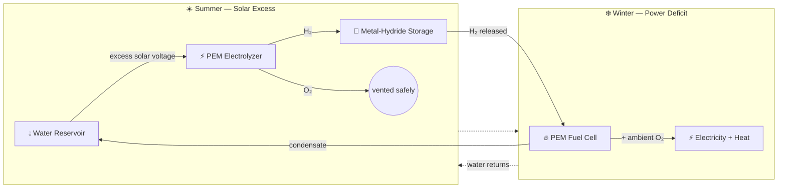
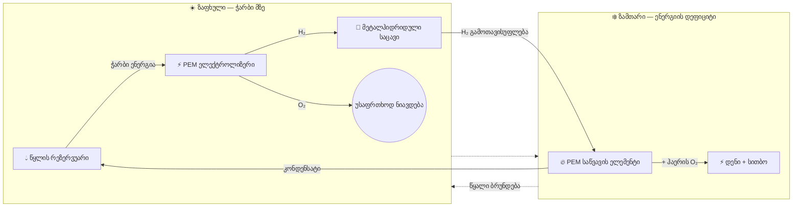

<div align="center">

# 🏔️ HydroGrid 🔋💧

### Seasonal Green Hydrogen Energy Storage for Off-Grid Alpine Facilities

[](https://prostogio.github.io/HydroGrid/)
[](https://prostogio.github.io/HydroGrid/presentation/dashboard/)
[](#)
[](#)

**A closed-loop hydrogen system that stores summer solar surplus and releases it as winter power — with pure water as the only byproduct.**

[🌐 Molecular Simulation](https://prostogio.github.io/HydroGrid/) · [📊 Interactive Energy Dashboard](https://prostogio.github.io/HydroGrid/presentation/dashboard/) · [English](#-overview) · [ქართული](#-პროექტის-მიმოხილვა)

</div>

---

## 📑 Table of Contents

- [Overview](#-overview)
- [The Problem](#-the-problem)
- [The Closed-Loop Architecture](#-the-closed-loop-architecture)
- [Simulation & Real-Data Validation](#-simulation--real-data-validation)
- [Why Not Just Batteries?](#-why-not-just-batteries)
- [System Control & Simulation](#-system-control--simulation)
- [Repository Structure](#-repository-structure)
- [ქართული ვერსია](#-პროექტის-მიმოხილვა)

---

## 🌍 Overview

Research stations, meteorological outposts, and ranger cabins in high-altitude regions rely almost entirely on solar power — until winter arrives. Blizzards, sub-zero temperatures, and shrinking daylight leave them exposed, since lithium-ion batteries lose efficiency below 0°C and can fail outright, forcing a fallback to diesel generators.

**HydroGrid removes that dependency.** It captures excess summer solar energy, converts it to hydrogen, stores it safely through winter, and converts it back into electricity and heat exactly when it's needed — in a fully closed loop where the only byproduct is pure, distilled water.

<details>
<summary><b>💭 Why does this matter? (click to expand)</b></summary>
<br>

Diesel logistics in alpine terrain are expensive, dangerous, and sometimes impossible — icy roads close entirely during the worst weather, right when fuel is needed most. Generators are also loud, emissions-heavy, and disruptive to the protected ecosystems these facilities usually sit within. HydroGrid sidesteps all of it: no fuel deliveries, no combustion emissions, no seasonal energy loss.

</details>

## ⚠️ The Problem

| Challenge | Conventional Approach | Limitation |
|---|---|---|
| Winter power gap | Diesel generators | Costly, hazardous fuel transport; road closures |
| Cold-weather storage | Lithium-ion batteries | Efficiency collapses below 0°C |
| Environmental impact | Combustion engines | Noise, emissions, ecosystem disruption |
| Energy carryover | Grid storage | Not viable off-grid |

## 🔄 The Closed-Loop Architecture

Unlike conventional battery setups or open-ended hydrogen designs, HydroGrid runs on a self-contained, infinite molecular loop:



| Stage | Component | Function |
|---|---|---|
| 1️⃣ | **Water Reservoir (H₂O)** | Starting and ending point; supplies purified water each season |
| 2️⃣ | **PEM Electrolyzer** | Splits water into H₂ and O₂ using summer solar surplus; O₂ is safely vented |
| 3️⃣ | **Metal-Hydride Storage** | Binds H₂ in a solid alloy lattice at low pressure (<30 bar) — no cold-weather degradation, leaks, or explosive risk |
| 4️⃣ | **PEM Fuel Cell** | Combines stored H₂ with ambient O₂ in winter, producing electricity and heat |
| 5️⃣ | **Condensate Return** | Fuel-cell byproduct water is condensed and returned to the reservoir, closing the loop |

## 🧪 Simulation & Real-Data Validation

Beyond the visual concept above, HydroGrid includes a full C++ simulation of the actual
energy math — solar input, electrolysis, storage, and power generation — plus an automated
controller that decides, day by day, whether the system should be charging or discharging.

**▶️ [Try the interactive energy dashboard](https://prostogio.github.io/HydroGrid/presentation/dashboard/)**
— drag the sliders for panel area, tank capacity, cabin need, and component cost, and watch
a real 90-day winter play out against the design live, including pass/fail and total cost.
(This dashboard reimplements the same formulas from the C++ source below in JavaScript, so it
can run directly in a browser — see [Repository Structure](#-repository-structure) for the
original implementation.)

**How this was actually built, stage by stage:**

1. **Solar energy** — derived irradiance-to-energy from first principles (W/m² → joules →
   kWh), including an altitude-adjustment term, rather than using a black-box formula.
2. **Electrolyzer** — converts electrical energy to hydrogen mass using hydrogen's real
   energy content (39.7 kWh/kg, the conservative HHV convention — chosen deliberately over
   the lower LHV figure so every result is a worst-case estimate).
3. **Storage** — the first stage requiring memory across time: a tank level that persists
   day to day, clamped between 0 and its max capacity.
4. **Fuel cell** — the mirror of the electrolyzer, converting stored hydrogen mass back to
   electricity (~55% efficient; the remaining ~45% becomes heat, documented as a
   cogeneration bonus rather than separately modeled).
5. **State machine** — ties all four physics stages together, comparing each day's solar
   output against cabin demand and deciding whether to charge the tank, discharge it, or
   fail honestly (reporting exactly which day and by how much) if the deficit can't be covered.

**What makes this more than a toy model:**

- The controller was run against **real 5-year hourly solar data (PVGIS-SARAH3)** for an
  actual high-altitude site in the Georgian Caucasus (2,715 m) — not synthetic weather. The
  worst real consecutive low-sun stretch found across that 5-year record was 5 days.
- It was then stress-tested against a scenario deliberately worse than anything in that real
  record (an extended 8-day storm), to check for margin beyond what history happened to show.
- An automated sweep searches panel-area × tank-capacity combinations against **both**
  datasets at once, optimizing for real component costs (~$180/m² panels, ~$1,800/kg
  effective metal-hydride storage cost — hydride alloy only stores ~1.5% of its own weight
  in H₂, making tank capacity the far more expensive lever than panel area).
- The sweep also tracks *wasted* surplus energy (H₂ produced but vented because the tank was
  already full), so "cheapest" accounts for more than just pass/fail.

**The honest scope of this result:** the specific panel/tank numbers found are valid for
*this* reference site's real climate data — HydroGrid is a sizing **methodology**, not a
universal spec. A different location (different altitude, different storm patterns) would
need its own historical solar data run back through the same pipeline.

<details>
<summary><b>📐 Key assumptions used throughout (click to expand)</b></summary>
<br>

- Panel efficiency: 20% · Electrolyzer efficiency: 75% · Fuel cell efficiency: 55%
- Hydrogen energy content: 39.7 kWh/kg (HHV) — the more conservative of the two standard
  conventions, chosen so every downstream result is a worst-case estimate, not a best case
- **Daily-total energy model:** the tank + fuel cell are assumed to buffer any within-day
  timing mismatch between production and use (e.g. energy produced at noon is available at
  3am). A real build would still need a charge controller and small buffer battery for
  electrical smoothing — a real hardware requirement, but a separate concern from the
  energy-balance question this simulation answers.
- Fuel-cell waste heat (~45% of energy content) is documented as a cogeneration/space-heating
  bonus, not separately modeled, since the project's core deliverable is electricity.
- **Metal-hydride desorption rate not modeled:** cold doesn't reduce a hydride tank's total
  storage *capacity* the way it does a battery's — a kg of stored H₂ stays a kg regardless of
  temperature. But releasing it is temperature-sensitive: real LaNi5 hydride studies show
  desorption rate increasing significantly with temperature (~1.5x faster at 50°C vs 25°C),
  so cold can slow down *how fast* hydrogen comes out, even when the total amount stored is
  unaffected — a rate limitation, not a capacity one, and the opposite failure mode from
  batteries. Real systems typically mitigate this with fuel-cell waste-heat recovery to warm
  the tank. This daily-total simulation doesn't capture rate-limited scenarios (see above).

</details>

## 🔋 Why Not Just Batteries?

A fair question, and one worth actually testing rather than assuming the answer. The
interactive dashboard includes a **Li-Ion vs. LiFePO4 vs. Hydrogen** toggle, using real 2026
battery pricing and real cold-weather capacity derating for each chemistry, run against the
exact same real winter data as the hydrogen results above.

**The receipts:**

| Storage | Config | Result vs. real + stress-tested winter |
|---|---|---|
| Hydrogen | 16 m² panels, **1 kg** tank | ✅ Survives, ~$4,680 |
| Li-Ion | 16 m² panels, **10 kWh** battery | ❌ Fails on day 8, ~$4,380 |
| LiFePO4 | 16 m² panels, **10 kWh** battery | ❌ Fails on day 23, ~$4,680 |

At **roughly the same total cost**, neither battery chemistry survives — even fully charged
on day 1, before winter even starts. The reason isn't capacity on paper, it's what cold does
to that capacity: standard Li-Ion cells can lose roughly half their usable capacity around
−20°C, and even LiFePO4 — which handles cold meaningfully better — still loses a real chunk
of usable capacity exactly when it's needed most. A "10 kWh" battery in a real alpine winter
is quietly a 4–6 kWh battery, and the math just doesn't recover from that.

Hydrogen storage doesn't have this problem — a 1 kg metal-hydride tank holds 1 kg regardless
of outside temperature. This is precisely the failure mode described back in
[The Problem](#-the-problem), now demonstrated with real numbers instead of asserted as a
premise. **Try it yourself** in the [dashboard](https://prostogio.github.io/HydroGrid/presentation/dashboard/)
— crank the battery slider up and see how much nameplate capacity it actually takes to catch up.

## 💻 System Control & Simulation

The hybrid power topology is orchestrated by a **C++ control layer**, using a
**state-machine** design to safely transition between storage and generation phases.

An interactive web-based simulation visualizes the molecular splitting/recombining cycle in real time:

**▶️ [Launch the molecular loop simulation](https://prostogio.github.io/HydroGrid/)**

## 📂 Repository Structure

```
HydroGrid/
├── hydrogrid.html                 # Molecular closed-loop visual simulation
├── src/
│   ├── solar_energy.cpp           # Altitude-adjusted solar → electrical energy
│   ├── electrolyzer.cpp           # Electricity → hydrogen mass
│   ├── storage.cpp                # Tank level bookkeeping (clamped 0 → max capacity)
│   ├── fuel_cell.cpp              # Hydrogen mass → electricity (+ heat, unmodeled)
│   ├── state_machine.cpp          # Full controller, synthetic/hand-entered input
│   ├── state_machine_real.cpp     # Full controller, real PVGIS irradiance input
│   └── sweep.cpp                  # Panel/tank cost-optimization search, waste-aware
├── presentation/
│   ├── dashboard/                 # Interactive browser-based energy dashboard (JS)
│   ├── en/ · ka/                  # Slide decks, bilingual
│   └── HydroGrid_Presentation*.pdf
└── README.md
```

---
---

<div align="center">

## 🇬🇪 ქართული ვერსია

</div>

## 📌 პროექტის მიმოხილვა

მაღალმთიან რეგიონებში მდებარე ობიექტები — კვლევითი სადგურები, მეტეოროლოგიური პუნქტები, რეინჯერთა კაბინები — ძირითადად მზის ენერგიაზეა დამოკიდებული. ზამთარში კი ქარბუქებისა და დაბალი ტემპერატურის გამო ისინი ხშირად ელექტროენერგიის გარეშე რჩებიან, რადგან ლითიუმის ბატარეები 0°C-ზე დაბლა კარგავენ ეფექტურობას და ზოგჯერ სრულად გამოდიან მწყობრიდან.

**HydroGrid** ხსნის ამ პრობლემას: ზაფხულში ჭარბი მზის ენერგია გარდაიქმნება წყალბადად, ინახება უსაფრთხოდ ზამთრამდე, შემდეგ კი უკან იქცევა დენად და სითბოდ — მთლიანად დახურულ ციკლში, სადაც ერთადერთი გამონაბოლქვი სუფთა წყალია.

<details>
<summary><b>💭 რატომ არის ეს მნიშვნელოვანი?</b></summary>
<br>

დიზელის ტრანსპორტირება მთის მყინვარულ გზებზე ძვირი და სახიფათოა, ხოლო ექსტრემალურ პირობებში ხშირად სრულიად შეუძლებელი. გენერატორები ასევე ხმაურიანია, გამოყოფენ მავნე აირებს და აზიანებენ დაცულ ეკოსისტემებს. HydroGrid გვერდს უვლის ამ ყველაფერს — არც საწვავის მიწოდებაა საჭირო, არც წვის ემისია და არც სეზონური ენერგოდანაკარგი.

</details>

## 🔄 დახურული ციკლის პრინციპი



| ეტაპი | კომპონენტი | ფუნქცია |
|---|---|---|
| 1️⃣ | **წყლის რეზერვუარი** | სისტემის საწყისი და ბოლო წერტილი |
| 2️⃣ | **PEM ელექტროლიზერი** | შლის წყალს H₂-ად და O₂-ად ზაფხულის ჭარბი ენერგიით |
| 3️⃣ | **მეტალჰიდრიდული საცავი** | ინახავს H₂-ს მყარ სტრუქტურაში, დაბალ წნევაზე (<30 bar) |
| 4️⃣ | **PEM საწვავის ელემენტი** | აერთებს შენახულ H₂-ს ჰაერის O₂-თან, გამოიმუშავებს დენსა და სითბოს |
| 5️⃣ | **კონდენსაციის წრედი** | რეაქციის შედეგად მიღებული წყალი უბრუნდება რეზერვუარს |

## 🧪 სიმულაცია და რეალურ მონაცემებზე ვალიდაცია

ვიზუალური კონცეფციის გარდა, HydroGrid მოიცავს სრულ C++ სიმულაციას რეალური ენერგეტიკული გამოთვლებით — მზის ენერგია, ელექტროლიზი, შენახვა და დენის გამომუშავება — და ავტომატურ კონტროლერს, რომელიც ყოველდღიურად წყვეტს, სისტემა უნდა იტენებოდეს თუ იხარჯებოდეს.

**▶️ [ინტერაქტიული ენერგეტიკული დაფის გახსნა](https://prostogio.github.io/HydroGrid/presentation/dashboard/)**
— გადაატანეთ ცოცხები (პანელის ფართობი, ავზის მოცულობა, კაბინის საჭიროება, კომპონენტების ღირებულება) და ნახეთ, როგორ იქცევა სისტემა რეალურ 90-დღიან ზამთარზე დაყრდნობით, პასუხის და ჩავარდნის ჩათვლით.

**რა არის რეალურად ვალიდირებული:**

კონტროლერი გატესტილია საქართველოს კავკასიონის რეალურ, 5-წლიან, საათობრივ მზის მონაცემებზე (PVGIS-SARAH3), 2,715 მეტრ სიმაღლეზე — არა სინთეზურ ამინდზე. რეალურ მონაცემებში ნაპოვნი ყველაზე ცუდი ზედიზედ დაბალმზიანი პერიოდი იყო 5 დღე. შემდეგ სისტემა შემოწმდა კიდევ უფრო რთულ, ხელოვნურად გახანგრძლივებულ 8-დღიან შტორმის სცენარზეც, რეალურ ჩანაწერზე უარესზე. ავტომატურმა ძიების ხელსაწყომ გადაამოწმა პანელის ფართობისა და ავზის მოცულობის კომბინაციები რეალური ღირებულებების მიხედვით (~$180/მ² პანელი, ~$1,800/კგ მეტალჰიდრიდის ეფექტური ღირებულება), ასევე ითვალისწინებს დაკარგულ ჭარბ ენერგიას.

**კვლევის პატიოსანი ფარგლები:** ნაპოვნი პანელისა და ავზის ზომები სწორია ამ კონკრეტული საცდელი წერტილის რეალურ კლიმატურ მონაცემებზე დაყრდნობით — HydroGrid წარმოადგენს ზომების განსაზღვრის **მეთოდოლოგიას**, და არა უნივერსალურ სპეციფიკაციას.

## 🔋 რატომ არა უბრალოდ ბატარეები?

სამართლიანი კითხვაა, და ჯობია ის რეალურად შემოწმდეს, ვიდრე უბრალოდ ვივარაუდოთ პასუხი. ინტერაქტიულ დაფას აქვს **Li-Ion / LiFePO4 / წყალბადის** გადამრთველი, რეალური 2026 წლის ფასებითა და თითოეული ქიმიის ცივ ამინდში რეალური ტევადობის კლებით, იმავე რეალურ ზამთრის მონაცემებზე გატესტილი.

**რეალური შედეგები:** 16 მ² პანელით, წყალბადის 1 კგ ავზი უძლებს სრულ (რეალურ + ხელოვნურად გართულებულ) ზამთარს ~$4,680-ად. იმავე ღირებულების მიდამოში, არც Li-Ion (10 კვტ.სთ) და არც LiFePO4 (10 კვტ.სთ) ვერ უძლებს — მე-8 ან 23-ე დღეს ჩავარდნით, მიუხედავად იმისა, რომ პირველივე დღეს სავსეა. მიზეზი ცივ ამინდში ტევადობის რეალური კლებაა — 10 კვტ.სთ ბატარეა ცივ მთაში ფაქტობრივად 4-6 კვტ.სთ-მდე იკლებს, ზუსტად მაშინ, როცა ყველაზე მეტად სჭირდება. მეტალჰიდრიდის ავზს ეს პრობლემა საერთოდ არ აქვს — 1 კგ რჩება 1 კგ ტემპერატურის მიუხედავად. სცადეთ თავად [ინტერაქტიულ დაფაზე](https://prostogio.github.io/HydroGrid/presentation/dashboard/).

## 💻 პროგრამული მართვა და სიმულაცია

სისტემის მუშაობას მართავს **C++**-ზე დაწერილი კონტროლის ფენა, **state-machine** არქიტექტურით უსაფრთხო გადართვისთვის შენახვასა და გამომუშავებას შორის.

**▶️ [სიმულაციის გაშვება](https://prostogio.github.io/HydroGrid/)**

<div align="center">

---
Made with ❄️ for extreme environments

</div>
