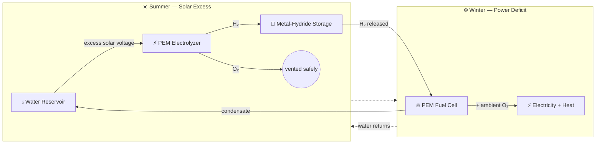
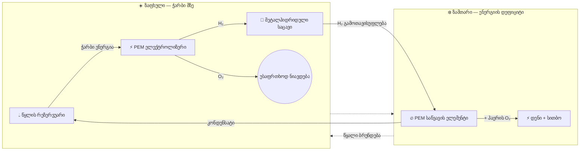

# 🏔️ HydroGrid 🔋💧

### Seasonal Green Hydrogen Energy Storage for Off-Grid Alpine Facilities

**A closed-loop hydrogen system that stores summer solar surplus and releases it as winter power — with pure water as the only byproduct.**

[🌐 Live Simulation](https://prostogio.github.io/HydroGrid/) · [English](#-overview) · [ქართული](#-პროექტის-მიმოხილვა)

---

## 📑 Table of Contents

- [Overview](#-overview)
- [The Problem](#-the-problem)
- [The Closed-Loop Architecture](#-the-closed-loop-architecture)
- [System Control & Simulation](#-system-control--simulation)
- [ქართული ვერსია](#-პროექტის-მიმოხილვა)

---

## 🌍 Overview

Research stations, meteorological outposts, and ranger cabins in high-altitude regions rely almost entirely on solar power — until winter arrives. Blizzards, sub-zero temperatures, and shrinking daylight leave them exposed, since lithium-ion batteries lose efficiency below 0°C and can fail outright, forcing a fallback to diesel generators.

**HydroGrid removes that dependency.** It captures excess summer solar energy, converts it to hydrogen, stores it safely through winter, and converts it back into electricity and heat exactly when it's needed — in a fully closed loop where the only byproduct is pure, distilled water.

<b>💭 Why does this matter? (click to expand)</b>

 

Diesel logistics in alpine terrain are expensive, dangerous, and sometimes impossible — icy roads close entirely during the worst weather, right when fuel is needed most. Generators are also loud, emissions-heavy, and disruptive to the protected ecosystems these facilities usually sit within. HydroGrid sidesteps all of it: no fuel deliveries, no combustion emissions, no seasonal energy loss.

## ⚠️ The Problem

| Challenge | Conventional Approach | Limitation |
|---|---|---|
| Winter power gap | Diesel generators | Costly, hazardous fuel transport; road closures |
| Cold-weather storage | Lithium-ion batteries | Efficiency collapses below 0°C |
| Environmental impact | Combustion engines | Noise, emissions, ecosystem disruption |
| Energy carryover | Grid storage | Not viable off-grid |

## 🔄 The Closed-Loop Architecture

Unlike conventional battery setups or open-ended hydrogen designs, HydroGrid runs on a self-contained, infinite molecular loop:

| Stage | Component | Function |
|---|---|---|
| 1️⃣ | **Water Reservoir (H₂O)** | Starting and ending point; supplies purified water each season |
| 2️⃣ | **PEM Electrolyzer** | Splits water into H₂ and O₂ using summer solar surplus; O₂ is safely vented |
| 3️⃣ | **Metal-Hydride Storage** | Binds H₂ in a solid alloy lattice at low pressure (<30 bar) — no cold-weather degradation, leaks, or explosive risk |
| 4️⃣ | **PEM Fuel Cell** | Combines stored H₂ with ambient O₂ in winter, producing electricity and heat |
| 5️⃣ | **Condensate Return** | Fuel-cell byproduct water is condensed and returned to the reservoir, closing the loop |

## 💻 System Control & Simulation

The hybrid power topology is orchestrated by a **C++ control layer** built for microcontrollers, using a **state-machine** design to safely transition between storage and generation phases.

An interactive web-based simulation visualizes the molecular splitting/recombining cycle in real time:

**▶️ [Launch the simulation](https://prostogio.github.io/HydroGrid/)**

---
---

## 🇬🇪 ქართული ვერსია

## 📌 პროექტის მიმოხილვა

მაღალმთიან რეგიონებში მდებარე ობიექტები — კვლევითი სადგურები, მეტეოროლოგიური პუნქტები, რეინჯერთა კაბინები — ძირითადად მზის ენერგიაზეა დამოკიდებული. ზამთარში კი ქარბუქებისა და დაბალი ტემპერატურის გამო ისინი ხშირად ელექტროენერგიის გარეშე რჩებიან, რადგან ლითიუმის ბატარეები 0°C-ზე დაბლა კარგავენ ეფექტურობას და ზოგჯერ სრულად გამოდიან მწყობრიდან.

**HydroGrid** ხსნის ამ პრობლემას: ზაფხულში ჭარბი მზის ენერგია გარდაიქმნება წყალბადად, ინახება უსაფრთხოდ ზამთრამდე, შემდეგ კი უკან იქცევა დენად და სითბოდ — მთლიანად დახურულ ციკლში, სადაც ერთადერთი გამონაბოლქვი სუფთა წყალია.

<b>💭 რატომ არის ეს მნიშვნელოვანი?</b>

 

დიზელის ტრანსპორტირება მთის მყინვარულ გზებზე ძვირი და სახიფათოა, ხოლო ექსტრემალურ პირობებში ხშირად სრულიად შეუძლებელი. გენერატორები ასევე ხმაურიანია, გამოყოფენ მავნე აირებს და აზიანებენ დაცულ ეკოსისტემებს. HydroGrid გვერდს უვლის ამ ყველაფერს — არც საწვავის მიწოდებაა საჭირო, არც წვის ემისია და არც სეზონური ენერგოდანაკარგი.

## 🔄 დახურული ციკლის პრინციპი

| ეტაპი | კომპონენტი | ფუნქცია |
|---|---|---|
| 1️⃣ | **წყლის რეზერვუარი** | სისტემის საწყისი და ბოლო წერტილი |
| 2️⃣ | **PEM ელექტროლიზერი** | შლის წყალს H₂-ად და O₂-ად ზაფხულის ჭარბი ენერგიით |
| 3️⃣ | **მეტალჰიდრიდული საცავი** | ინახავს H₂-ს მყარ სტრუქტურაში, დაბალ წნევაზე (<30 bar) |
| 4️⃣ | **PEM საწვავის ელემენტი** | აერთებს შენახულ H₂-ს ჰაერის O₂-თან, გამოიმუშავებს დენსა და სითბოს |
| 5️⃣ | **კონდენსაციის წრედი** | რეაქციის შედეგად მიღებული წყალი უბრუნდება რეზერვუარს |

## 💻 პროგრამული მართვა და სიმულაცია

სისტემის მუშაობას მართავს **C++**-ზე დაწერილი კონტროლის ფენა მიკროკონტროლერებისთვის, **state-machine** არქიტექტურით უსაფრთხო გადართვისთვის შენახვასა და გამომუშავებას შორის.

**▶️ [სიმულაციის გაშვება](https://prostogio.github.io/HydroGrid/)**

---
Made with ❄️ for extreme environments

