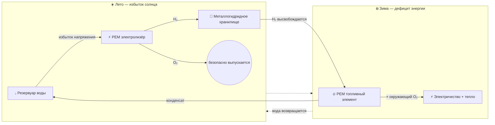

<div align="center">

# 🏔️ HydroGrid 🔋💧

### Сезонное хранение зелёного водорода для автономных высокогорных объектов

[](https://prostogio.github.io/HydroGrid/)
[](https://prostogio.github.io/HydroGrid/presentation/dashboard/)
[](#)
[](#)

**Замкнутая водородная система, которая накапливает летний избыток солнечной энергии и отдаёт его как зимнюю электроэнергию — с чистой водой в качестве единственного побочного продукта.**

[🌐 Молекулярная симуляция](https://prostogio.github.io/HydroGrid/) · [📊 Интерактивная панель](https://prostogio.github.io/HydroGrid/presentation/dashboard/) · [🧩 Схема системы](https://prostogio.github.io/HydroGrid/presentation/schematicRU/)

**Читать на:** [English](./README.md) · Русский · [ქართული](./README.ka.md)

</div>

---

## 📑 Содержание

- [Обзор](#-обзор)
- [Проблема](#-проблема)
- [Архитектура замкнутого цикла](#-архитектура-замкнутого-цикла)
- [Схема системы](#-схема-системы)
- [Симуляция и валидация на реальных данных](#-симуляция-и-валидация-на-реальных-данных)
- [Почему не просто батареи?](#-почему-не-просто-батареи)
- [Управление системой и симуляция](#-управление-системой-и-симуляция)
- [Структура репозитория](#-структура-репозитория)

---

## 🌍 Обзор

Исследовательские станции, метеопосты и домики рейнджеров в высокогорных регионах почти полностью зависят от солнечной энергии — пока не приходит зима. Метели, отрицательные температуры и сокращение светового дня оставляют их без энергии, поскольку литий-ионные батареи теряют эффективность ниже 0°C и могут полностью отказать, вынуждая переходить на дизельные генераторы.

**HydroGrid устраняет эту зависимость.** Система накапливает избыток летней солнечной энергии, превращает его в водород, безопасно хранит всю зиму и снова превращает в электричество и тепло именно тогда, когда это нужно — в полностью замкнутом цикле, где единственный побочный продукт — чистая дистиллированная вода.

<details>
<summary><b>💭 Почему это важно? (нажмите, чтобы раскрыть)</b></summary>
<br>

Доставка дизельного топлива в горной местности дорога, опасна, а иногда и вовсе невозможна — ледяные дороги полностью закрываются именно в худшую погоду, когда топливо нужнее всего. Генераторы также шумны, выделяют вредные выбросы и нарушают экосистемы охраняемых территорий, на которых обычно расположены такие объекты. HydroGrid решает всё это разом: не нужна доставка топлива, нет выбросов от сжигания, нет сезонных потерь энергии.

</details>

## ⚠️ Проблема

| Проблема | Обычное решение | Ограничение |
|---|---|---|
| Нехватка энергии зимой | Дизельные генераторы | Дорогая и опасная доставка топлива; закрытие дорог |
| Хранение энергии в холод | Литий-ионные батареи | Эффективность резко падает ниже 0°C |
| Воздействие на экологию | Двигатели внутреннего сгорания | Шум, выбросы, нарушение экосистемы |
| Перенос энергии между сезонами | Хранение через электросеть | Невозможно вне сети |

## 🔄 Архитектура замкнутого цикла

В отличие от обычных батарейных решений или незамкнутых водородных схем, HydroGrid работает по полностью автономному, бесконечному молекулярному циклу:



| Этап | Компонент | Функция |
|---|---|---|
| 1️⃣ | **Резервуар воды (H₂O)** | Начальная и конечная точка; поставляет очищенную воду каждый сезон |
| 2️⃣ | **PEM электролизёр** | Расщепляет воду на H₂ и O₂, используя летний избыток солнца; O₂ безопасно выпускается |
| 3️⃣ | **Металлогидридное хранилище** | Связывает H₂ в твёрдой сплавной решётке при низком давлении (<30 бар) — без деградации в холод, утечек или риска взрыва |
| 4️⃣ | **PEM топливный элемент** | Зимой соединяет накопленный H₂ с окружающим O₂, вырабатывая электричество и тепло |
| 5️⃣ | **Возврат конденсата** | Побочная вода топливного элемента конденсируется и возвращается в резервуар, замыкая цикл |

## 🧩 Схема системы

Все компоненты сверх пяти основных этапов — контроллер заряда, очистка воды, осушение газа, предохранительные клапаны, датчики, маршрутизация отработанного тепла — представлены в виде интерактивной схемы с подсказками при наведении. Доступна на трёх языках:

**▶️ [English](https://prostogio.github.io/HydroGrid/presentation/schematicEN/) · [Русский](https://prostogio.github.io/HydroGrid/presentation/schematicRU/) · [ქართული](https://prostogio.github.io/HydroGrid/presentation/schematicGE/)**

Наведите курсор или нажмите на любой блок или соединитель, чтобы увидеть подробности. Жирные пронумерованные блоки и стрелка возврата — это основной пятиступенчатый цикл; всё остальное — вспомогательные подсистемы (питание, безопасность, датчики, вывод на объект).

## 🧪 Симуляция и валидация на реальных данных

Помимо визуальной концепции выше, HydroGrid включает полную C++ симуляцию реальных
энергетических расчётов — солнечная энергия, электролиз, хранение и выработка энергии — а
также автоматический контроллер, который ежедневно решает, должна ли система заряжаться
или разряжаться.

**▶️ [Открыть интерактивную панель](https://prostogio.github.io/HydroGrid/presentation/dashboard/)**
— подвигайте ползунки (площадь панелей, ёмкость бака, потребность домика, стоимость
компонентов) и посмотрите, как система переживает реальную 90-дневную зиму, включая успех/
провал и итоговую стоимость. (Эта панель повторяет те же формулы из C++ кода на JavaScript,
чтобы работать прямо в браузере — см. [Структуру репозитория](#-структура-репозитория) для
оригинальной реализации.)

**Как это было построено, этап за этапом:**

1. **Солнечная энергия** — вывод из первых принципов (Вт/м² → джоули → кВт·ч), включая
   поправку на высоту, а не готовая формула из справочника.
2. **Электролизёр** — превращает электроэнергию в массу водорода, используя реальную
   энергоёмкость водорода (39.7 кВт·ч/кг, консервативная конвенция HHV — выбрана намеренно
   вместо более низкой LHV, чтобы каждый результат был оценкой худшего случая).
3. **Хранилище** — первый этап, требующий памяти во времени: уровень бака сохраняется изо
   дня в день, ограничен между 0 и максимальной ёмкостью.
4. **Топливный элемент** — зеркало электролизёра, превращающее массу водорода обратно в
   электричество (~55% эффективности; оставшиеся ~45% становятся теплом, задокументировано
   как бонус когенерации, но отдельно не моделируется).
5. **Конечный автомат** — связывает все четыре физических этапа вместе, сравнивая
   ежедневную выработку солнца с потребностью домика и решая, заряжать бак, разряжать его,
   или честно сообщить о провале (указав точный день и величину дефицита), если недостачу
   покрыть нельзя.

**Что делает это больше, чем просто игрушечная модель:**

- Контроллер был протестирован на **реальных 5-летних почасовых солнечных данных
  (PVGIS-SARAH3)** для настоящей высокогорной точки в грузинском Кавказе (2,715 м) — а не на
  синтетической погоде. Худший реальный подряд идущий период низкой солнечной активности в
  этих данных составил 5 дней.
- Затем система была протестирована на сценарии, намеренно худшем, чем что-либо реально
  наблюдавшееся (искусственно продлённый 8-дневный шторм), чтобы проверить запас прочности
  сверх исторического рекорда.
- Автоматический инструмент поиска перебирает комбинации площади панелей и ёмкости бака по
  обоим наборам данных одновременно, оптимизируя по реальной стоимости компонентов
  (~$180/м² панели, ~$1,800/кг эффективной стоимости хранения гидрида) — а не просто по
  принципу «выживает или нет».
- Поиск также отслеживает *потерянную* избыточную энергию (H₂, произведённый, но
  выпущенный впустую, поскольку бак уже был полон), так что «самое дешёвое» решение
  учитывает больше, чем просто факт выживания.

**Честные рамки этого результата:** конкретные найденные значения площади панелей и ёмкости
бака верны для реальных климатических данных *этой конкретной* контрольной точки — HydroGrid
представляет собой **методологию** расчёта размеров, а не универсальную спецификацию. Другое
место (другая высота, другие штормовые паттерны) потребовало бы собственных исторических
солнечных данных, прогнанных через тот же конвейер.

<details>
<summary><b>📐 Ключевые допущения, используемые повсюду (нажмите, чтобы раскрыть)</b></summary>
<br>

- КПД панелей: 20% · КПД электролизёра: 75% · КПД топливного элемента: 55%
- Энергоёмкость водорода: 39.7 кВт·ч/кг (HHV) — более консервативная из двух стандартных
  конвенций, выбрана так, чтобы каждый результат далее по цепочке был оценкой худшего, а не
  лучшего случая
- **Модель суточных сумм энергии:** предполагается, что бак и топливный элемент буферизуют
  любое несовпадение по времени внутри суток между производством и потреблением (например,
  энергия, произведённая в полдень, доступна в 3 часа ночи). Реальная система всё равно
  потребует контроллер заряда и небольшую буферную батарею для электрического сглаживания —
  это реальное требование к оборудованию, но отдельный вопрос от энергобаланса, который
  решает эта симуляция.
- Отработанное тепло топливного элемента (~45% энергоёмкости) задокументировано как бонус
  когенерации/отопления, но отдельно не моделируется, поскольку основной результат проекта —
  электричество.
- **Скорость десорбции металлогидрида не моделируется:** холод не уменьшает общую *ёмкость*
  хранения гидридного бака так, как это происходит с батареей — кг накопленного H₂ остаётся
  кг независимо от температуры. Но высвобождение чувствительно к температуре: реальные
  исследования сплавов LaNi5 показывают, что скорость десорбции значительно растёт с
  температурой (~в 1.5 раза быстрее при 50°C, чем при 25°C), так что холод может замедлить
  *скорость*, с которой выходит водород, даже если общее накопленное количество не меняется —
  это ограничение скорости, а не ёмкости, и противоположный батареям режим отказа. Реальные
  системы обычно смягчают это, используя отработанное тепло топливного элемента для подогрева
  бака. Эта посуточная симуляция не отражает сценарии с ограничением скорости (см. выше).

</details>

## 🔋 Почему не просто батареи?

Справедливый вопрос, и его стоит реально проверить, а не просто предполагать ответ.
Интерактивная панель включает переключатель **Li-Ion / LiFePO4 / Водород**, использующий
реальные цены 2026 года и реальное снижение ёмкости в холод для каждой химии, протестированный
на тех же самых реальных зимних данных, что и результаты по водороду выше.

**Факты:**

| Хранение | Конфигурация | Результат на реальной + усложнённой зиме |
|---|---|---|
| Водород | 16 м² панелей, бак **1 кг** | ✅ Выдерживает, ~$4,680 |
| Li-Ion | 16 м² панелей, батарея **10 кВт·ч** | ❌ Отказ на 8-й день, ~$4,380 |
| LiFePO4 | 16 м² панелей, батарея **10 кВт·ч** | ❌ Отказ на 23-й день, ~$4,680 |

При **примерно одинаковой общей стоимости** ни одна из батарейных химий не выдерживает —
даже будучи полностью заряженной в первый день, до начала зимы. Причина не в ёмкости на
бумаге, а в том, что холод делает с этой ёмкостью: обычные Li-Ion элементы могут терять
примерно половину полезной ёмкости при −20°C, и даже LiFePO4 — которая справляется с холодом
заметно лучше — всё равно теряет реальную часть полезной ёмкости именно тогда, когда она
нужнее всего. «10 кВт·ч» батарея в реальную альпийскую зиму незаметно превращается в
батарею на 4–6 кВт·ч, и математика уже не восстанавливается после этого.

Водородное хранилище не имеет этой проблемы — металлогидридный бак на 1 кг хранит 1 кг
независимо от температуры снаружи. Это именно тот режим отказа, который был описан ранее в
разделе [Проблема](#-проблема), теперь подтверждённый реальными цифрами, а не заявленный как
предпосылка. **Проверьте сами** на [панели](https://prostogio.github.io/HydroGrid/presentation/dashboard/)
— увеличьте ползунок батареи и посмотрите, сколько номинальной ёмкости реально нужно, чтобы
догнать водород.

## 💻 Управление системой и симуляция

Гибридной энергетической топологией управляет **слой управления на C++**, использующий
архитектуру **конечного автомата** для безопасного переключения между режимами хранения и
выработки энергии.

Интерактивная веб-симуляция визуализирует цикл расщепления/рекомбинации молекул в реальном времени:

**▶️ [Запустить молекулярную симуляцию](https://prostogio.github.io/HydroGrid/)**

## 📂 Структура репозитория

```
HydroGrid/
├── hydrogrid.html                 # Визуальная молекулярная симуляция замкнутого цикла
├── src/
│   ├── solar_energy.cpp           # Солнце с поправкой на высоту → электроэнергия
│   ├── electrolyzer.cpp           # Электроэнергия → масса водорода
│   ├── storage.cpp                # Учёт уровня бака (ограничен 0 → макс. ёмкость)
│   ├── fuel_cell.cpp              # Масса водорода → электроэнергия (+ тепло, не моделируется)
│   ├── state_machine.cpp          # Полный контроллер, синтетический/ручной ввод
│   ├── state_machine_real.cpp     # Полный контроллер, реальные данные PVGIS
│   └── sweep.cpp                  # Поиск оптимальной стоимости панелей/бака, с учётом потерь
├── presentation/
│   ├── dashboard/                 # Интерактивная браузерная панель (JS)
│   ├── schematicEN/ · schematicRU/ · schematicGE/  # Интерактивная схема, на трёх языках
│   ├── en/ · ka/                  # Слайды презентации, двуязычные
│   └── HydroGrid_Presentation*.pdf
├── README.md                      # Английский
├── README.ru.md                   # Этот файл (русский)
└── README.ka.md                   # Грузинский
```

<div align="center">

---
Сделано с ❄️ для экстремальных условий

</div>
